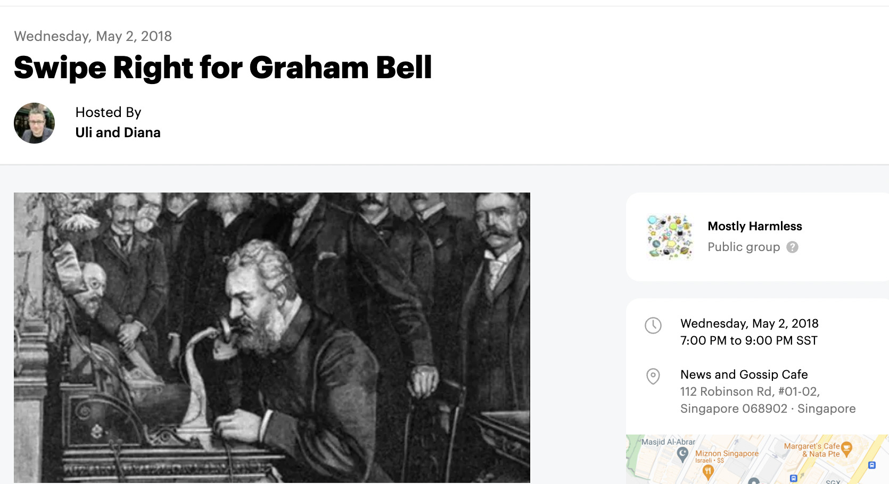
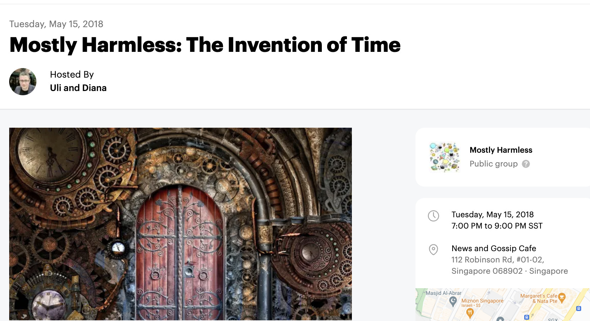
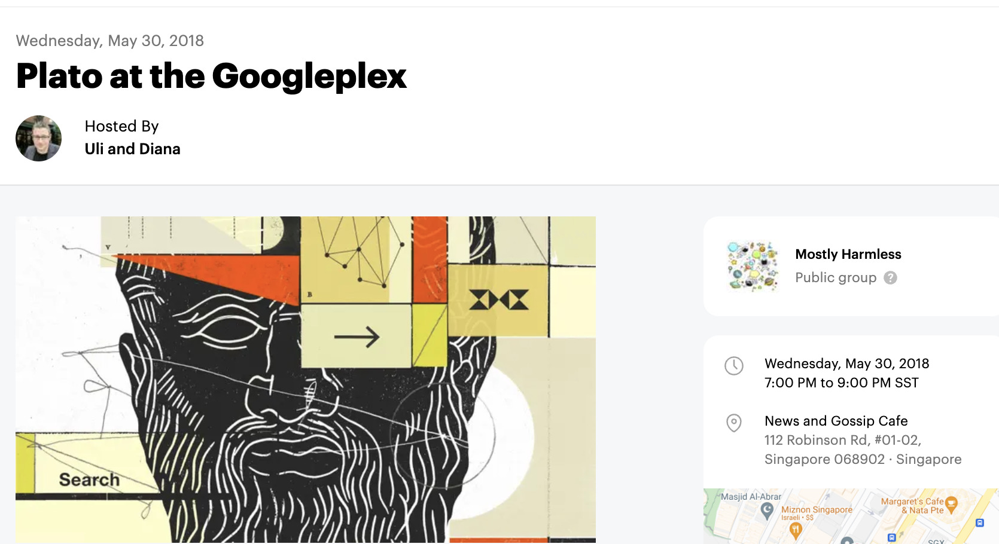
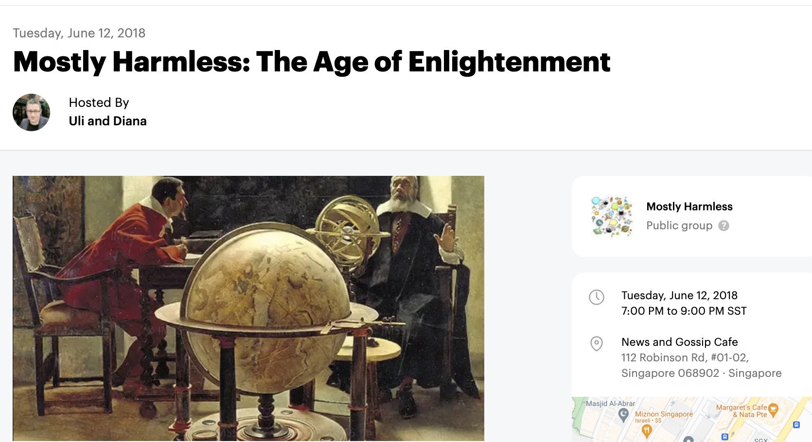
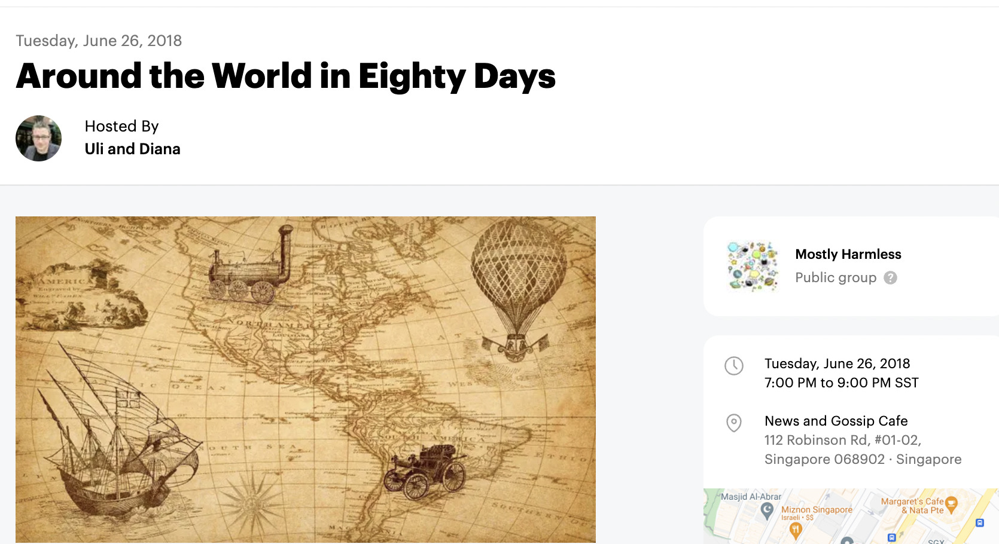
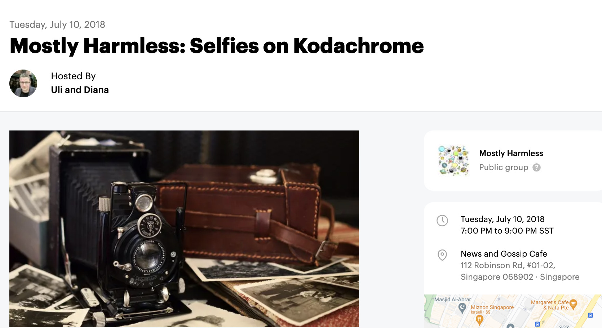

# Mostly Harmless

Geeks, street philosophers, and junk food enthusiasts meeting over drinks to discuss current affairs and hot topics at the intersection of technology and humanity. The impact of 'digital' on the way we communicate, work and learn. The question whether there's intelligent life on earth. And sometimes, it's really just about where in town they serve the best kebab.

## Selected Events

Around 600 years ago, a bloke called Johannes Gutenberg had a genius idea: he'd be selling engraved combs to pilgrims en route to Strasbourg so they'd have a token to bring back home from their journey. But soon enough, the plague would spread all over Europe and destroy all his plans - to get the venture capitalists off his back, Gutenberg quickly brought one of his discarded hobby projects back to life: the letterpress.

What would the world look like without this early piece of information technology? Should certain presidents be banned from using Twitter? And, most importantly, has anyone tried that new kebab place downtown yet?

This is 'Mostly Harmless', where geeks, street philosophers, and junk food enthusiasts meet over drinks after work to discuss current affairs and topics at the intersection of technology and humanity.

In the 19th century, a middle-aged sociopath by the name of Alexander Graham Bell conceived an ingenious new apparatus: the telephone. Well aware that 93% of human communication was non-verbal, Bell hoped his new device would help accelerate social alienation and cultural decay - an endeavor which is finally reaching completion after Steve Jobs introduced the smartphone to the general public in 2007. What would the world look like without the screens we hold in our hands? And, more importantly, how are we supposed to order Burger King when UberEats shuts down?

This is 'Mostly Harmless', where geeks, street philosophers, and junk food enthusiasts meet over drinks after work to discuss current affairs and topics at the intersection of technology and humanity.

One weekend in late July of the year 1582, Pope Gregory had just about enough. He'd been looking forward to his annual summer retreat in the South of France when the papal envoys reported that the region was hit by yet another snow storm. Snow in July? Something had to be done! After a few weeks of tinkering, his task force came back with a new, debugged version of the Julian calendar, the decision to skip ten days in October, and a patch that should prevent the problem from happening again: the leap year.

How did the financial sector back then manage to calculate interest rates accordingly? Is this change responsible for Oktoberfest happening mostly in September? And, most importantly, can we please have white asparagus all year round?

This is 'Mostly Harmless', where geeks, street philosophers, and junk food enthusiasts meet over drinks after work to discuss current affairs and topics at the intersection of technology and humanity.

It's a lovely Friday afternoon in Mountain View, California when a 2,400-year-old dude in sandals walks into the Google headquarters at Amphitheatre Parkway. Plato, best-selling author of paperback novels including 'The Republic' and 'Symposium' is accompanied by his agent who had the genius idea for him to go on a book tour promoting his latest work, 'Philosophy for Dummies'. And just as the crowd of Googlers pours into the pantry to play with their phones during his Q&A session, our time-traveling writer does what he usually does best: questioning the whole thing.

What would Plato think of Google's omniscient search engine that grows smarter by the day? Is philosophy still relevant to us in 2018? And most importantly, is it safe to assume that Plato got his fix of Gyros at the Google canteen?

This is 'Mostly Harmless', where geeks, street philosophers, and junk food enthusiasts meet over drinks after work to discuss current affairs and topics at the intersection of technology and humanity.

In late summer of the year 1684, a local substitute teacher and aspiring astronomer by the name of Edmond Halley sat down at the Oxford Coffee Club to enjoy a serving of an incredibly stimulating and virtually nutritionless beverage brewed from peanut-size beans that had just made their way into Europe from East Africa. Soon enough, he'd find himself engaged in a lively discussion with a certain Isaac Newton, suggesting the mysterious object they'd observed in the sky not long ago had indeed been bullying humans since the beginning of time and was also the same comet destroying Anglo-Saxon Europe at the Battle of Hastings in 1066. Intrigued to find a use case where his newly invented calculus applied, Newton agreed to write the one book that, sponsored by Halley, would set the basis for classical mechanics and open the road for the industrial revolution: Philosophiæ Naturalis Principia Mathematica

Did the introduction of coffee fuel the Age of Enlightenment in Europe? Is anybody going to come up with an equivalent for the 21st century where our systems are so used to coffee that we need a much stronger jump starter to resuscitate our collective brains? And most importantly, wasn't beer invented for the sole purpose of us being able to tolerate humanity?

This is 'Mostly Harmless', where geeks, street philosophers, and junk food enthusiasts meet over drinks after work to discuss current affairs and topics at the intersection of technology and humanity.

In the spring of 1871, an intern at a bicycle repair shop in south-west Germany started to get really fed up with scrubbing animal feces off his customers’ two-wheelers on a daily basis and came up with a genius idea - the horseless carriage. After a failed career as a locksmith he decided to get serious about the project and on 3rd of July 1886, Karl Benz officially unveiled the Benz Patent-Motorwagen, the first purpose-built automobile. His innovation came in a time where other forms of transport emerged, most notably, a new class of steamships - a major driver of the first wave of trade globalization and contributor to an increase in international trade that was unprecedented in human history.

Today, information travels around the globe within fractions of a second. Will Hyperloop at some point allow humans to do the same? How long do we have to wait for those flying cars? And, more importantly, why did Erich's currywurst booth move from Chinatown to that inaccessible part of west Singapore?

This is 'Mostly Harmless', where geeks, street philosophers, and junk food enthusiasts meet over drinks after work to discuss current affairs and topics at the intersection of technology and humanity.

One Sunday morning in late autumn of the year 1839, an obsessive amateur chemist named Robert Cornelius was sneaking into his father’s study at the back of the family store in Philadelphia, looking to toy with a fascinating apparatus that had just come in from Europe. Centuries after the first Camera Obscura, Sir John Herschel had eventually found a way of preserving light on paper using glass negatives, while coining the term 'photography' along the way. So back in that room in Philadelphia, Robert spontaneously decided to remove the lens cap from the camera and sit in front of it for a while - and within a few minutes he had turned a technical innovation into a narcissistic art form by taking a specific type of photo that in 2013 would become the word of the year: the selfie.

An image speaks a thousand words, the world would not be the same without photography. What’s going to happen to the millions of digital images we’re taking on a daily basis? Will it at some point in time be possible to ‘unsee’ things, please? And, most importantly, don’t these Instagram photos of that lobster roll place in Telok Ayer look stunning?

This is 'Mostly Harmless', where geeks, street philosophers, and junk food enthusiasts meet over drinks after work to discuss current affairs and topics at the intersection of technology and humanity.
