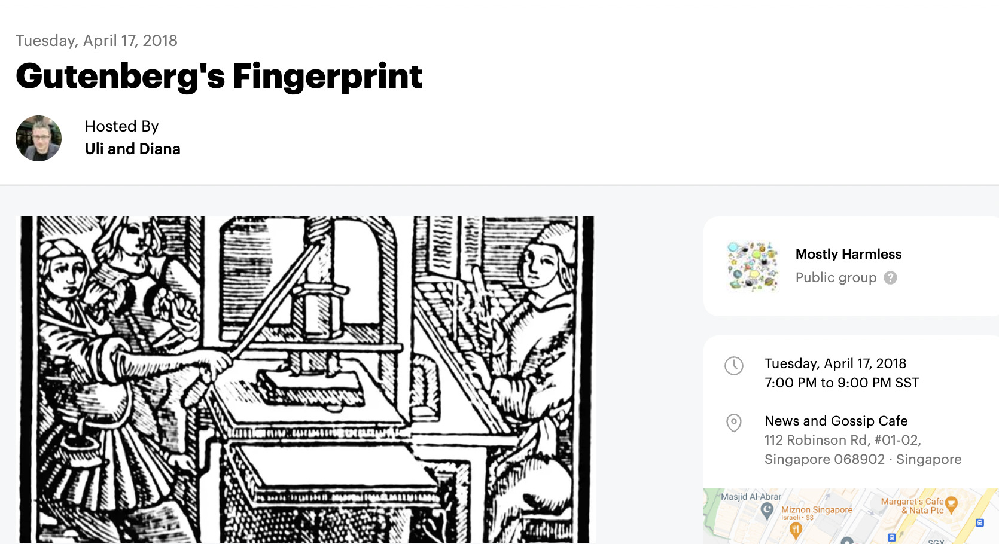

# Mostly Harmless

Geeks, street philosophers, and junk food enthusiasts meeting over drinks to discuss current affairs and hot topics at the intersection of technology and humanity. The impact of 'digital' on the way we communicate, work and learn. The question whether there's intelligent life on earth. And sometimes, it's really just about where in town they serve the best kebab.

## Selected Events

Around 600 years ago, a bloke called Johannes Gutenberg had a genius idea: he'd be selling engraved combs to pilgrims en route to Strasbourg so they'd have a token to bring back home from their journey. But soon enough, the plague would spread all over Europe and destroy all his plans - to get the venture capitalists off his back, Gutenberg quickly brought one of his discarded hobby projects back to life: the letterpress.

What would the world look like without this early piece of information technology? Should certain presidents be banned from using Twitter? And, most importantly, has anyone tried that new kebab place downtown yet?